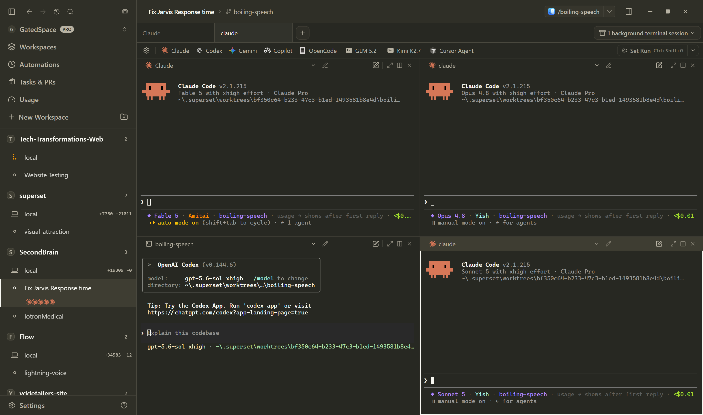

<div align="center">


# GatedSpace

### An agentic development environment for Windows

Run Claude Code, Codex, Gemini, and any other CLI coding agent in parallel,
each in its own isolated git worktree, with built-in terminals, diff review,
and workspace management.

**Free. No account. No cloud. Everything runs on your machine.**

[](https://github.com/yzgershon/GatedSpace/releases/latest)
[](https://github.com/yzgershon/GatedSpace/releases)
[](https://github.com/yzgershon/GatedSpace/actions/workflows/ci.yml)
[](https://github.com/yzgershon/GatedSpace/releases/latest)
[](./LICENSE.md)

[**Download**](https://github.com/yzgershon/GatedSpace/releases/latest) &nbsp;&bull;&nbsp;
[What it does](#what-it-does) &nbsp;&bull;&nbsp;
[Build from source](#build-from-source) &nbsp;&bull;&nbsp;
[Report an issue](https://github.com/yzgershon/GatedSpace/issues)

<br />



<sub>Four agents, four models, one workspace — Claude Code (Fable 5, Opus 4.8, Sonnet 5) and OpenAI Codex running side by side.</sub>

</div>

## Download

Grab the installer for your PC from the
[latest release](https://github.com/yzgershon/GatedSpace/releases/latest):

| Your PC | Installer |
|---|---|
| Most Windows PCs (Intel or AMD) | [`GatedSpace-x64.exe`](https://github.com/yzgershon/GatedSpace/releases/latest/download/GatedSpace-x64.exe) |
| Windows on ARM (Snapdragon laptops, Surface Pro X, etc.) | [`GatedSpace-arm64.exe`](https://github.com/yzgershon/GatedSpace/releases/latest/download/GatedSpace-arm64.exe) |

Not sure which? Open **Settings → System → About** and check **System type**.

The app auto-updates from this repository's releases after install.

### "Windows protected your PC"?

The installers are not code-signed yet, so SmartScreen shows a warning on first
run. Click **More info**, then **Run anyway**. Every installer is built from
this repository's source by GitHub Actions, and you can audit the exact build in
the [Actions tab](https://github.com/yzgershon/GatedSpace/actions).

## What it does

- **Parallel agents.** Run several Claude Code / Codex / Gemini / any-CLI-agent
  sessions side by side, each in its own git worktree, so agents never step on
  each other's changes.
- **Workspaces.** One project, many worktrees. Create, switch, and tear down
  branches without touching your main checkout.
- **Built-in terminals.** Persistent PTY sessions that survive app restarts,
  and even PC reboots.
- **Review before you merge.** Built-in diff view for each workspace, then
  open in your editor of choice.
- **Claude account profiles.** Optionally declare multiple Claude accounts
  (`~/.superset/claude-profile.json`) and GatedSpace routes new agents to
  whichever one has usage left.
- **Usage dashboard.** Real token usage and quota tracking for Claude Code and
  Codex, read from their local session files. Nothing is polled or uploaded.
- **Local-only by design.** No account, no analytics keys baked into public
  builds, all data in local SQLite. Your code never leaves your machine.

## How it relates to Superset

GatedSpace is a Windows port of [Superset](https://github.com/superset-sh/superset)
(see [NOTICE.md](./NOTICE.md); this project is not affiliated with Superset, Inc.).

| | Superset (upstream) | GatedSpace |
|---|---|---|
| Platforms | macOS, Linux | Windows 10/11, x64 + ARM64 |
| Account | Sign-in + cloud backend | None. Fully local |
| Price | Free tier + paid plans | Free. Every feature unlocked |

## Requirements

- Windows 10/11, x64 or ARM64
- [Git](https://git-scm.com/) on your PATH
- The agents you want to run (e.g. [Claude Code](https://docs.anthropic.com/en/docs/claude-code),
  [Codex](https://github.com/openai/codex)) installed and signed in

## Build from source

```bash
git clone https://github.com/yzgershon/GatedSpace.git
cd GatedSpace
bun install
cd apps/desktop
bun run compile:app
bun run package -- --publish never
```

Requires [Bun](https://bun.sh) (see `.bun-version`), Node.js, and on Windows
the Visual Studio 2022 C++ build tools for native modules. Public builds set
`NEXT_PUBLIC_LOCAL_ONLY=1` at compile time to bake in local-only mode.

## Contributing

Bug reports and pull requests are welcome. Start with
[CONTRIBUTING.md](./CONTRIBUTING.md) for the dev setup and PR process, and
[SECURITY.md](./SECURITY.md) for reporting vulnerabilities.

## Credits & license

GatedSpace is a modified version of [Superset](https://github.com/superset-sh/superset)
by Superset, Inc. The upstream team deserves the credit for the product
design and the vast majority of the code. This fork adds the Windows port,
the local-only mode, and the rebrand; it is **not affiliated with or endorsed
by Superset, Inc.**

Licensed under the [Elastic License 2.0](./LICENSE.md), same as upstream.
See [NOTICE.md](./NOTICE.md) for details.
